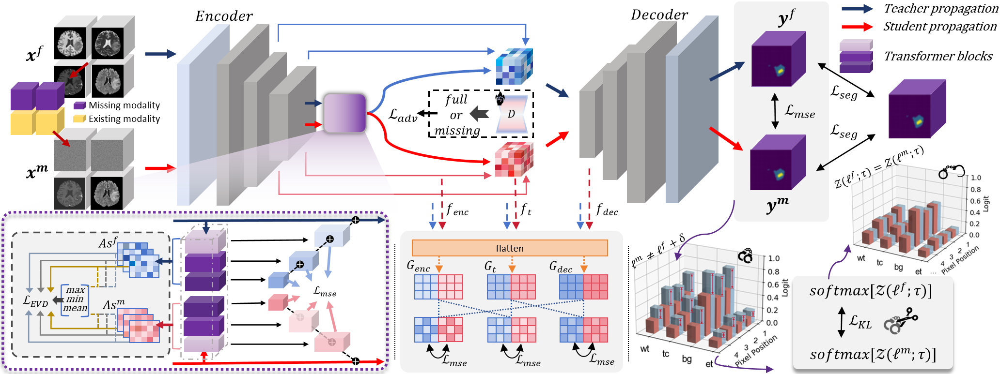

>📋 For code accompanying Muti-scale Transformer Knowledge Distillation Network of the paper

# Bridging the Gap in Missing Modalities: Leveraging Knowledge Distillation and Style Matching for Brain Tumor Segmentation

<div align="center">

[](https://github.com/Quanato607/MST-KDNet)
[](https://github.com/Quanato607/MST-KDNet)
[](https://github.com/Quanato607/MST-KDNet)
[](https://arxiv.org/abs/2030.12345)
</div>

This repository is the official implementation of **[MST-KDNet](https://arxiv.org/abs/2030.12345)**. Our method maintains **robust** and **accurate segmentation performance even under severe modality loss**. Furthermore, to reduce redundancy in modality-specific features, we incorporate **global and local feature refinements** to **systematically align available modalities and mitigate missing ones**.

## 🎥Visualization for Implementation on Software 

<div align="center">

</div>

## 💡Primary contributions

To overcome the challenges of missing or incomplete MRI modalities in brain tumor segmentation, we propose **MST-KDNet**. This is a novel framework for **cross-modality consistency** and **robust tumor segmentation in 3D medical images based on knowledge distillation and style matching**. Our key contributions are summarized as follows:

1) 🕐 MST-KDNet architecture achieves **efficient segmentation** under **missing modalities** by selectively aligning multi-scale Transformer features. This design effectively bridges modality gaps while preserving tumor boundary details.

2) 🕑 MST-KDNet significantly accelerates **inference**, **requiring only a compact distillation procedure instead of heavy fusion modules**, making it more adaptable to real-world clinical settings.

3) 🕒 We introduce **Global Style Matching Module (GSME)** to harmonize **heterogeneous modality features** and **retain texture consistency** even with severely missing imaging signals, without extra costly training data.

4) 🕓 Extensive experiments on both the **BraTS 2024** and **FeTS 2024 datasets** demonstrate **superior performance** and **robustness** of MST-KDNet, achieving state-of-the-art results especially in scenarios with multiple missing modalities.

## 🧗Proposed method
<br><br>

<br><br>

The overall framework of **MST-KDNet**. The Teacher propagation processes all available modalities, while the student propagation accommodates incomplete inputs.

## Table of Contents
- [Requirements](#-Requirements)
- [Training](#-Training)
- [Evaluation](#-Evaluation)
- [Results](#-Results)
- [Contributing](#-Contributing)

## 📝 Requirements

To install requirements:

```setup
pip install -r requirements.txt
```

## 🔥 Training

To train our model in the paper, run this command:

```train
python train.py
```

>📋 Before training, specify the data set and training configuration using the config.xml file

## 📃 Evaluation

To evaluate our model in the paper, run this command:

```eval
python eval.py
```

<br><br>

<br><br>

>📋 Comparison of segmentation results under four missing-modality scenarios: (1) all modalities, (2) FLAIR + T1ce + T2, (3) FLAIR + T1ce, and (4) FLAIR only. From left to right, the figure shows T1, T2, T1ce, and FLAIR images; ground-truth labels for two patients; three columns of comparison-study results; three columns of ablation-study results; and our final segmentation. Color legend: WT = red + yellow + green, TC = red + yellow, ET = red.
  
## 🚀 Results

Our model achieves the following performance on :

---

### Comparative Experiments on BraTS 2024

**1. Unimodal Robustness**

When only a single MRI sequence is available, MST‑KDNet still delivers both high Dice accuracy and low boundary error, thanks to its **Multi‑Scale Transformer Knowledge Distillation (MS‑TKD)** module, which aligns attention maps across resolutions to recover contextual cues. MS‑TKD works by distilling the teacher’s most salient attention patterns—peaks, troughs and average activations—into the student at every transformer layer, so that even with just one input, the student “knows” where tumors typically appear and how they span across scales.

* **T2 only**

  * Dice (WT/TC/ET): **77.2 % / 47.3 % / 48.3 %** vs. SMUNet’s 75.0 % / 29.3 % / 25.5 %
  * HD95 (WT/TC/ET): **8.1 mm / 12.0 mm / 11.7 mm** vs. SMUNet’s 9.1 mm / 14.0 mm / 13.5 mm

* **T1Gd only**

  * Dice: **72.9 % / 68.3 % / 68.6 %** vs. SMUNet’s 67.9 % / 64.1 % / 64.8 %
  * HD95: **11.1 mm / 4.9 mm / 4.5 mm** vs. SMUNet’s 13.3 mm / 6.3 mm / 5.4 mm

* **T1 only**

  * Dice: **73.5 % / 44.5 % / 32.0 %** vs. SMUNet’s 69.6 % / 28.2 % / 25.0 %
  * HD95: **11.0 mm / 11.2 mm / 10.5 mm** vs. SMUNet’s 5.9 mm / 14.0 mm / 14.0 mm

* **FLAIR only**

  * Dice: **84.7 % / 33.9 % / 40.6 %** vs. SMUNet’s 84.2 % / 28.8 % / 25.1 %
  * HD95: **6.7 mm / 12.1 mm / 11.9 mm** vs. SMUNet’s 12.2 mm / 13.4 mm / 13.0 mm

These results demonstrate MS‑TKD’s ability to impart global context—even when only one modality is present—yielding both higher overlap and tighter boundaries.

**2. Bimodal & Trimodal Gains**

Adding a second or third modality further reduces boundary error and boosts accuracy. This improvement is driven by the **Global Style Matching Module (GSME)**, which adversarially aligns global feature statistics—mean and variance—between the student’s fused features and the teacher’s multi‑modal style. By correcting modality‑specific brightness and texture shifts, GSME ensures that the student sees a consistent “appearance” regardless of which sequences are present, sharpening tumor boundaries and reducing spurious errors.

* **Bimodal inputs** (e.g. T1Gd + T2, T1 + T1Gd, …)

  * Dice **79.8 %–85.7 % / 50.1 %–71.3 % / 48.5 %–72.3 %**, outperforming competitors by 3–8 pp
  * HD95 **4.6 mm–9.2 mm / 3.7 mm–10.5 mm / 3.3 mm–10.6 mm** vs. SMUNet’s **5.1 mm–11.2 mm / 4.2 mm–12.2 mm / 2.8 mm–12.0 mm**

* **Trimodal inputs** (e.g. FLAIR + T1 + T1Gd, …)

  * Dice **80.0 %–86.9 % / 59.5 %–73.1 % / 59.8 %–73.9 %**, again leading by several points
  * HD95 **4.7 mm–5.1 mm / 3.4 mm–5.1 mm / 2.9 mm–5.3 mm** vs. SMUNet’s **4.8 mm–5.3 mm / 3.7 mm–4.3 mm / 2.8 mm–5.3 mm**

Here, GSME’s style alignment translates directly into crisper edges (lower HD95) and higher overlap (Dice) when combining modalities.

**3. Full‑Modality Peak Performance**

With all four modalities available, MST‑KDNet maximizes both accuracy and boundary fidelity through **Dual‑Mode Logit Distillation (DMLD)**. DMLD employs a combined mean‐squared error on logits and a temperature‑scaled KL divergence to smooth out discrepancies between the student’s outputs under missing‑modality and full‑modality conditions. This dual‑mode supervision ensures predictions remain stable and consistent, ironing out boundary irregularities and false positives.

* **Dice (WT/TC/ET):** **86.8 % / 73.1 % / 73.9 %** vs. SMUNet’s 79.7 % / 50.7 % / 49.3 %
* **HD95 (WT/TC/ET):** **6.6 mm / 7.2 mm / 6.8 mm** vs. SMUNet’s 7.4 mm / 8.5 mm / 8.0 mm

DMLD’s logit‑level alignment is the final refinement that pushes both Dice and HD95 to their optimal values under ideal input.


### [Comparison Experiment on BraTS 2024 with Dice metric](https://www.synapse.org/Synapse:syn53708249)

| Type   | Model      | T2   | T1Gd | T1   | FLAIR | T1Gd+T2 | T1+T1Gd | FLAIR+T1 | T1+T2 | FLAIR+T2 | FLAIR+T1Gd | FLAIR+T1+T1Gd | FLAIR+T1+T2 | FLAIR+T1Gd+T2 | T1+T1Gd+T2 | FLAIR+T1+T1Gd+T2 | Avg.  |
| :----: | :--------: | :----: | :-----: | :-----: | :------: | :-------: | :-------: | :--------: | :-----: | :--------: | :-----------: | :--------------: | :-----------: | :--------------: | :-----------: | :----------------: | :-----: |
| **WT** | RA-HVED    |   75.4  |   51.3  |    9.5  |    71.4  |      77.5  |      53.4  |      72.9   |   76.1   |      80.1   |      72.9     |         80.6     |     80.4     |         77.7     |     80.1    |             68.8    |  68.8 |
|        | RMBTS      |   70.1  |   51.2  |   51.8  |    65.0  |      75.3  |      60.6  |      76.4   |   75.0   |      77.3   |      76.0     |         79.7     |     80.3     |         76.1     |     80.9    |             71.7    |  71.7 |
|        | mmformer   |   72.6  |   55.5  |   61.3  |    72.7  |      74.3  |      65.4  |      79.2   |   75.1   |      79.6   |      78.3     |         80.7     |     81.0     |         75.6     |     81.3    |             74.2    |  74.2 |
|        | M2FTrans   |   72.5  |   58.8  |   62.0  |    73.0  |      73.9  |      64.2  |      77.4   |   73.6   |      78.9   |      77.0     |         78.5     |     79.5     |         74.2     |     78.8    |             73.3    |  73.3 |
|        | ACN        |   69.6  |   58.7  |   60.1  |    80.7  |      71.8  |      63.6  |      82.1   |   72.2   |      82.3   |      81.3     |         82.8     |     82.0     |         72.5     |     82.5    |             75.0    |  75.0 |
|        | SMUNet     |   75.0  |   67.9  |   69.6  |    84.2  |      76.7  |      70.6  |      84.6   |   77.1   |      85.2   |      85.2     |         85.6     |     86.0     |         77.2     |     86.0    |             79.7    |  79.7 |
|        | MST‑KDNet  |**77.2** |**72.9** |**73.5** |**84.7**  |**79.8**    |**75.1**    |**85.7**     |**79.3**  |**85.8**     |**86.4**        |**86.5**           |**86.1**       |**86.9**           |**80.0**      |**86.8**             |**81.8**|
| **TC** | RA-HVED    |   26.5  |   54.2  |    9.4  |**41.1**  |      61.3  |      54.8  |      41.9   |   29.2   |      40.5   |      61.9     |         62.5     |     43.2     |         64.0     |     61.9    |             65.0    |  47.8 |
|        | RMBTS      |   10.9  |   36.5  |   12.6  |    11.2  |      40.4  |      37.6  |      16.8   |   15.2   |      14.5   |      38.9     |         40.1     |     17.4     |         40.4     |     40.9    |             40.6    |  27.6 |
|        | mmformer   |   47.2  |   52.3  |   44.4  |    33.1  |      62.6  |      60.6  |      49.6   |**51.1**  |      49.6   |      60.6     |         64.3     |     52.6     |         65.5     |     65.3    |             67.0    |  55.1 |
|        | M2FTrans   |   46.6  |   53.3  |   43.3  |    33.8  |      60.0  |      57.7  |      46.7   |   48.5   |      48.3   |      57.8     |         60.0     |     49.6     |         61.5     |     60.8    |             62.0    |  52.7 |
|        | ACN        |   21.2  |   54.2  |   19.5  |    22.5  |      58.8  |      57.9  |      26.1   |   23.2   |      26.7   |      60.0     |         63.8     |     28.3     |         62.6     |     62.7    |             64.1    |  43.4 |
|        | SMUNet     |   29.3  |   64.1  |   28.2  |    28.8  |      67.3  |      67.1  |      32.6   |   31.5   |      32.5   |      66.9     |         70.4     |     33.7     |         69.4     |     69.1    |             69.8    |  50.7 |
|        | MST‑KDNet  |**47.3** |**68.3** |**44.5** |    33.9  |**70.3**    |**71.3**    |**50.1**     |   41.5   |**50.2**     |**72.0**       |**74.1**           |**53.6**       |**72.5**          |**72.6**     |**73.1**            |**59.5**|
| **ET** | RA-HVED    |   35.8  |   37.8  |    9.2  |    39.8  |      42.3  |      36.6  |      42.6   |   43.8   |      44.4   |      44.1     |         43.9     |     48.4     |         46.8     |     40.7    |             45.9    |  40.1 |
|        | RMBTS      |    7.9  |   37.8  |   10.0  |     8.2  |      41.9  |      40.1  |      13.1   |   11.8   |      10.8   |      40.6     |         43.5     |     14.0     |         42.3     |     44.1    |             55.2    |  28.1 |
|        | mmformer   |   44.9  |   50.5  |   42.3  |    31.4  |      61.3  |      59.0  |      45.3   |   49.4   |      46.6   |      59.3     |         63.0     |     49.6     |         63.6     |     64.2    |             65.7    |  53.1 |
|        | M2FTrans   |   47.1  |   54.2  |**44.6** |    34.0  |      62.6  |      60.0  |      47.5   |   49.4   |      49.3   |      60.2     |         62.7     |     50.4     |         64.5     |     63.4    |             65.0    |  54.3 |
|        | ACN        |   18.0  |   55.2  |   16.9  |    19.6  |      59.8  |      59.6  |      22.2   |   19.2   |      22.4   |      60.8     |         65.1     |     23.9     |         64.0     |     64.3    |             65.9    |  42.5 |
|        | SMUNet     |   25.5  |   64.8  |   25.0  |    25.1  |      67.9  |      68.1  |      28.6   |   27.6   |      28.6   |      67.9     |         70.6     |     29.7     |         69.8     |     70.1    |             70.8    |  49.3 |
|        | MST‑KDNet  |**48.3** |**68.6** |   32.0  |**40.6**  |**70.0**    |**72.3**    |**48.5**     |**50.1**  |**51.1**     |**72.4**       |**74.9**           |**52.5**       |**72.8**          |**73.1**     |**73.9**            |**59.8**|

### [Comparison Experiment on BraTS 2024 with HD95 metric](https://www.synapse.org/Synapse:syn53708249)

|   Type   |    Model     |  T2  | T1Gd |  T1  | FLAIR | T1Gd+T2 | T1+T1Gd | FLAIR+T1 | T1+T2 | FLAIR+T2 | FLAIR+T1Gd | FLAIR+T1+T1Gd | FLAIR+T1+T2 | FLAIR+T1Gd+T2 | T1+T1Gd+T2 | FLAIR+T1+T1Gd+T2 |  Avg.   |
|:--------:|:------------:|:------:|:------:|:------:|:-------:|:---------:|:---------:|:----------:|:-------:|:----------:|:------------:|:---------------:|:------------:|:---------------:|:-----------:|:-----------------:|:-------:|
| **WT**   | RA‑HVED      | 22.1   | 40.2   | 57.7   | 23.8    | 19.8      | 34.8      | 20.9       | 17.4    | 16.9       | 21.2         | 20.5            | 15.0         | 16.3            | 18.6         | 15.9              | 24.1    |
|          | RMBTS        | 39.1   | 63.6   | 57.7   | 59.4    | 36.1      | 50.1      | 41.7       | 33.1    | 37.4       | 47.8         | 34.8            | 33.2         | 35.3            | 34.1         | 34.0              | 42.5    |
|          | mmformer     | 19.5   | 52.0   | 40.7   | 18.2    | 18.8      | 34.5      | 13.9       | 16.8    | 13.1       | 15.5         | 13.4            | 12.9         | 12.2            | 16.8         | 11.8              | 20.7    |
|          | M2FTrans     | 43.8   | 51.8   | 47.0   | 47.3    | 42.4      | 44.5      | 43.0       | 42.6    | 42.1       | 41.9         | 41.3            | 41.3         | 40.7            | 40.8         | 40.5              | 43.4    |
|          | ACN          | 11.6   | 28.4   | 29.6   | 11.8    | 13.5      | 20.4      | 11.4       | 15.6    | 10.3       | 13.2         | 11.7            | 10.2         | 11.5            | 15.1         | 10.3              | 15.0    |
|          | SMUNet       |  9.1   | 13.3   |**5.9** | 12.2    |  5.9      |**7.6**    | 11.2       |  5.4    |  7.7       |**5.1**       |  5.2            |  5.3         |  4.9            |  4.8         |  8.0              |  7.4    |
|          | MST‑KDNet    |**8.1** |**11.1**| 11.0   |**6.7**  |**5.3**    |  9.2      |**6.1**     |**5.2**  |**4.6**     |  6.2         |**5.1**          |**5.0**       |**4.7**          |**4.7**       |**5.3**            |**6.6**  |
| **TC**   | RA-HVED      | 25.3   | 30.4   | 57.1   | 22.5    | 15.8      | 26.8      | 20.9       | 23.1    | 19.7       | 15.9         | 14.4            | 21.6         | 13.3            | 16.2         | 12.5              | 22.4    |
|          | RMBTS        | 24.8   | 23.1   | 47.1   | 24.1    | 19.8      | 25.8      | 23.7       | 21.9    | 19.1       | 18.5         | 16.3            | 20.0         | 15.6            | 14.0         | 13.7              | 21.8    |
|          | mmformer     | 27.7   | 62.1   | 39.1   | 24.3    | 25.6      | 38.7      | 19.7       | 24.1    | 19.3       | 20.5         | 17.3            | 18.7         | 15.4            | 22.1         | 14.7              | 26.0    |
|          | M2FTrans     | 79.4   | 79.2   | 82.6   | 82.4    | 76.3      | 76.3      | 79.7       | 79.2    | 79.5       | 78.5         | 77.5            | 78.3         | 77.0            | 77.0         | 76.3              | 78.6    |
|          | ACN          | 15.7   |  9.2   | 19.3   | 18.2    |  6.4      |  8.5      | 17.3       | 17.0    | 15.7       |  6.6         |  6.2            | 17.6         |  5.8            |  6.2         |  5.8              | 11.7    |
|          | SMUNet       | 14.0   |  6.3   | 14.0   | 13.4    |  4.4      |  5.0      | 12.2       | 12.1    | 12.0       |  4.8         |  4.3            | 11.9         |  4.2            |  4.5         |  4.6              |  8.5    |
|          | MST‑KDNet    |**12.0**|**4.9** |**11.2**|**12.1** |**3.7**    |**4.3**    |**10.5**    |**10.8** |**11.0**    |**3.6**       |**3.4**          |**10.0**      |**3.7**          |**3.3**       |**4.0**            |**7.2**  |
| **ET**   | RA-HVED      | 12.9   | 25.0   | 47.0   | 15.2    | 14.9      | 23.7      | 13.2       | 10.9    | 10.8       | 14.0         | 14.2            | 11.0         | 12.8            | 15.4         | 12.2              | 16.9    |
|          | RMBTS        | 23.8   | 21.9   | 44.8   | 23.7    | 19.2      | 24.2      | 22.4       | 21.9    | 19.5       | 17.2         | 15.1            | 19.5         | 15.2            | 13.5         | 13.3              | 21.0    |
|          | mmformer     | 26.4   | 59.8   | 37.6   | 23.2    | 24.0      | 36.7      | 18.6       | 22.2    | 18.4       | 18.3         | 16.4            | 17.7         | 14.5            | 20.4         | 14.0              | 24.5    |
|          | M2FTrans     | 23.4   | 31.5   | 21.5   | 24.1    | 16.1      | 16.2      | 16.2       | 19.4    | 20.9       | 16.8         | 13.3            | 18.5         | 15.3            | 14.2         | 13.9              | 18.8    |
|          | ACN          | 14.7   |  8.0   | 19.3   | 18.1    |  6.1      |  7.6      | 16.6       | 16.4    | 14.9       |  5.9         |  5.3            | 17.2         |  5.2            |  5.3         |  5.2              | 11.1    |
|          | SMUNet       | 13.5   |  5.4   | 14.0   | 13.0    |  3.9      |  4.3      | 11.8       | 11.5    | 12.0       |  4.1         |  3.7            | 11.3         |  3.7            |  4.0         |  4.0              |  8.0    |
|          | MST‑KDNet    |**11.7**|**4.5** |**10.5**|**11.9** |**3.3**    |**3.8**    |**9.8**     |**10.3** |**10.6**    |**3.2**       |**3.0**          |**9.8**       |**3.3**          |**2.9**       |**3.0**            |**6.8**  |

---

### Comparative Experiments on BraTS 2024

### [Comparison Experiment on FeTS 2024 with Dice metric](https://www.synapse.org/Synapse:syn53708249)

**1. Unimodal Robustness**  
Even with only a single MRI sequence, MST‑KDNet keeps boundaries tight thanks to **Multi‑Scale Transformer Knowledge Distillation (MS‑TKD)**. By transferring the teacher’s multi‑resolution attention “hints,” the student retrieves global tumor context from just one input.

- **T2 only:** HD95 drops to ~6.5 mm (vs. ~7.1 mm in other methods)  
- **T1Gd only:** HD95 around ~9.4 mm (vs. ~10.1 mm)  
- **T1 only:** HD95 near ~10.2 mm (vs. ~11.2 mm)  
- **FLAIR only:** HD95 shrinks to ~5.0 mm (vs. ~5.9 mm)

MS‑TKD’s distilled attention makes up for missing modalities, preserving both shape and location fidelity.


**2. Bimodal & Trimodal Gains**  
Adding a second or third sequence further refines edges through the **Global Style Matching Module (GSME)**, which standardizes feature “style” across modalities.

- **Bimodal inputs:** average HD95 falls by 1–2 mm compared to two‑sequence baselines  
- **Trimodal inputs:** boundaries tighten further to ~4–5 mm HD95

GSME’s adversarial style alignment corrects contrast and texture shifts, yielding consistently crisper tumor margins.


**3. Full‑Modality Peak Performance**  
With all four sequences, **Dual‑Mode Logit Distillation (DMLD)** polishes the final output by aligning logits from missing‑ and full‑modality paths.

- **All four modalities:** HD95 reaches ~4.1 mm—the lowest across all configurations

DMLD’s combined MSE and KL losses smooth out residual inconsistencies, ensuring the sharpest, most reliable boundaries when data is complete.


|   Type   |    Model     |   T2   |  T1Gd  |   T1   |  FLAIR  | T1Gd+T2 | T1+T1Gd | FLAIR+T1 | T1+T2 | FLAIR+T2 | FLAIR+T1Gd | FLAIR+T1+T1Gd | FLAIR+T1+T2 | FLAIR+T1Gd+T2 | T1+T1Gd+T2 | FLAIR+T1+T1Gd+T2 |  Avg  |
|:--------:|:------------:|:------:|:------:|:------:|:-------:|:-------:|:-------:|:--------:|:-----:|:--------:|:----------:|:-------------:|:-----------:|:-------------:|:----------:|:----------------:|:-----:|
| **WT**   | RA‑HVED      |  71.1  |  54.4  |  49.6  |  66.4   |  75.3   |  59.7   |   66.6   |  75.7 |   75.1   |    69.2    |      70.3      |    79.1     |      77.2     |    76.2    |       80.0       |  69.7 |
|          | RMBTS        |  69.9  |  54.6  |  65.6  |  71.8   |  71.5   |  70.0   |   83.3   |  80.1 |   76.2   |    73.4    |      84.0      |    84.8     |      76.5     |    80.8    |       85.2       |  75.2 |
|          | mmformer     |  66.2  |  59.9  |  50.6  |  70.8   |  68.8   |  62.7   |   72.8   |  67.5 |   73.7   |    73.8    |      74.1      |    73.6     |      74.5     |    69.7    |       74.3       |  68.9 |
|          | M2FTrans     |  81.9  |  71.0  |  65.9  |  79.4   |  84.4   |  75.6   |   84.6   |  83.8 |   86.7   |    84.2    |      85.8      |    87.2     |      87.7     |    84.8    |       87.8       |  82.0 |
|          | ACN          |  84.0  |  74.2  |  71.3  |  88.4   |  85.6   |  75.9   |   88.6   |  85.6 |   89.2   |    88.6    |      88.9      |    89.1     |      89.5     |    85.7    |       89.6       |  84.9 |
|          | SMUNet       |  86.7  |  78.8  |  77.4  |  90.0   |  87.8   |  80.6   |   90.6   |  87.7 |   90.7   |    90.5    |      90.7      |    91.0     |      91.2     |    88.0    |       91.4       |  87.5 |
|          | MST‑KDNet    |**87.6**|**81.4**|**80.3**|**90.3** |**88.2** |**82.8** |**90.9**  |**88.4**|**91.2**  |**91.1**    |**91.2**        |**91.3**     |**91.5**       |**88.4**   |**91.5**         |**88.4**|
| **TC**   | RA‑HVED      |  47.1  |  63.8  |  35.0  |  45.3   |  70.1   |  69.1   |   45.2   |  51.5 |   50.5   |    71.8    |      71.2      |    52.4     |      74.5     |    75.5    |       77.9       |  60.0 |
|          | RMBTS        |  46.4  |  39.2  |  69.9  |  40.6   |  50.6   |  71.2   |   71.9   |  72.3 |   52.2   |    48.1    |      72.2      |    72.5     |      53.5     |    72.5    |       72.8       |  60.4 |
|          | mmformer     |  42.0  |  59.5  |  32.9  |  42.2   |  64.7   |  64.0   |   47.7   |  44.0 |   47.9   |    62.5    |      65.8      |    49.3     |      64.1     |    65.9    |       66.0       |  54.6 |
|          | M2FTrans     |  57.6  |  81.2  |  52.9  |  59.7   |  85.3   |  81.2   |   66.9   |  62.4 |   67.6   |    84.6    |      85.3      |    69.4     |      86.0     |    85.9    |       85.6       |  74.3 |
|          | ACN          |  67.9  |  85.6  |  59.9  |  69.6   |  87.7   |  86.8   |   70.9   |  68.6 |   71.5   |    87.9    |      88.6      |    71.7     |      87.7     |    88.5    |       88.7       |  78.8 |
|          | SMUNet       |  74.2  |  88.6  |  70.4  |  74.5   |  90.0   |  89.2   |   76.1   |  74.9 |   76.4   |    90.4    |      90.5      |    76.9     |      90.6     |    90.2    |       90.6       |  82.9 |
|          | MST‑KDNet    |**76.2**|**90.0**|**73.0**|**76.9** |**90.9** |**90.7** |**78.5**  |**76.5**|**78.8**  |**90.8**    |**91.1**        |**78.5**     |**91.0**       |**90.9**   |**91.1**         |**84.3**|
| **ET**   | RA‑HVED      |  32.2  |  61.1  |  22.3  |  28.5   |  67.6   |  66.2   |   29.3   |  32.9 |   34.5   |    67.4    |      66.5      |    36.4     |      71.3     |    72.7    |       74.0       |  50.9 |
|          | RMBTS        |  45.3  |  38.0  |**78.7**|  39.9   |  49.3   |  81.3   |**83.0**  |**82.5**|   51.2   |    47.7    |  83.4          |**83.4**     |      53.1     |   83.6 |      83.8    |  65.6 |
|          | mmformer     |  25.4  |  60.2  |  12.5  |  31.9   |  61.7   |  64.4   |   33.8   |  25.8 |   35.1   |    62.0    |      64.4      |    34.9     |      60.9     |    63.3    |       62.6       |  46.6 |
|          | M2FTrans     |  38.4  |  77.6  |  30.7  |  41.4   |  80.5   |  79.6   |   46.1   |  42.6 |   50.1   |    81.2    |      81.5      |    51.5     |      61.2     |    81.0    |       81.1       |  63.0 |
|          | ACN          |  50.3  |  79.7  |  41.5  |  50.8   |  81.9   |  81.3   |   51.7   |  50.7 |   54.3   |    82.5    |      83.0      |    54.3     |      84.7     |    82.2    |       82.6       |  67.3 |
|          | SMUNet       |  57.2  |  83.3  |  52.0  |  56.5   |  84.4   |  84.1   |   58.7   |  58.1 |  60.9    |  85.2      |  85.3          |   61.2     |  84.9         |  84.6     |         84.9      |  72.1 |
|          | MST‑KDNet    |**59.3**|**84.5**|  54.6  |**59.2** |**85.1** |**84.8** |   61.2   |  59.9  |**62.9**  |**85.6**    |**85.7**        |  62.7     |**85.4**       |**85.3**   |       **85.5**    |**73.4**|

### [Comparison Experiment on FeTS 2024 with HD95 metric](https://www.synapse.org/Synapse:syn53708249)

|   Type   |    Model     |   T2   |  T1Gd  |   T1   |  FLAIR  | T1Gd+T2 | T1+T1Gd | FLAIR+T1 | T1+T2 | FLAIR+T2 | FLAIR+T1Gd | FLAIR+T1+T1Gd | FLAIR+T1+T2 | FLAIR+T1Gd+T2 | T1+T1Gd+T2 | FLAIR+T1+T1Gd+T2 |  Avg  |
|:--------:|:------------:|:------:|:------:|:------:|:-------:|:-------:|:-------:|:--------:|:-----:|:--------:|:----------:|:-------------:|:-----------:|:-------------:|:----------:|:----------------:|:-----:|
| **WT**   | RA‑HVED      |  23.2  |  31.7  |  36.5  |  27.9   |  18.4   |  25.2   |  25.2    | 21.3  |  21.5    |    20.2    |      17.9      |    16.6     |      16.0     |    14.3     |       13.4        | 22.0  |
|          | RMBTS        |  10.8  |  13.8  |  14.1  |   9.5   |   9.0   |  12.0   |   5.8    |  7.3  |   8.1    |     8.0    |       5.1      |     5.0     |       7.9     |     7.6     |        4.7        |  8.6  |
|          | mmformer     |  26.9  |  34.7  |  31.8  |  33.5   |  28.4   |  28.7   |  25.2    | 24.3  |  24.9    |    24.5    |      22.8      |    23.6     |      23.3     |    26.3     |       21.5        | 26.7  |
|          | M2FTrans     |  35.1  |  32.6  |  29.2  |  26.8   |  25.7   |  27.6   |  24.4    | 28.2  |  23.2    |    27.6    |      24.9      |    22.3     |      23.4     |    23.7     |       23.1        | 26.5  |
|          | ACN          |   9.1  |  13.6  |  16.8  |   6.9   |   7.3   |  12.2   |   7.3    |  7.7  |   6.7    |     7.2    |       7.1      |     6.6     |       6.3     |     7.4     |        5.9        |  8.5  |
|          | SMUNet       |   7.1  |  10.1  |  11.2  |   5.9   | **5.8** |   9.4   |   5.3    |  6.2  |   5.3    |     5.1    |       5.2      |   **4.8**   |      **4.3**  |     5.6     |        4.8        |  6.4  |
|          | MST‑KDNet    |**6.5** |**9.4** |**10.2**|**5.0**  |   6.1   |**9.0**  | **4.8**  |**5.7**| **5.0**  |  **4.3**   |   **4.3**     |  **4.6**    |   **4.0**    |   **5.8**   |   **4.1**        | **5.9** |
| **TC**   | RA‑HVED      | 23.3   | 23.6   | 40.2   | 27.8    | 14.7    | 19.1    | 28.1     | 23.5  | 24.5     | 13.4       | 13.8           | 23.2        | 12.7          | 10.0        | 10.6             | 22.4  |
|          | RMBTS        | 33.0   | 35.1   | 22.5   | 30.0    | 32.1    | 19.1    | 19.5     | 19.2  | 29.2     | 27.1       | 20.7           | 21.9        | 27.1          | 20.8        | 20.5             | 25.2  |
|          | mmformer     | 32.9   | 35.2   | 35.7   | 41.7    | 26.9    | 24.3    | 27.7     | 28.7  | 30.4     | 22.3       | 18.4           | 26.4        | 20.7          | 23.6        | 18.3             | 27.5  |
|          | M2FTrans     | 23.5   | 17.1   | 28.5   | 24.4    |  9.4    | 11.6    | 18.7     | 16.3  | 14.1     | 11.6       | 10.2           | 12.9        |  8.2          |  7.0        |  8.4             | 14.8  |
|          | ACN          | 12.7   |  7.3   | 16.8   | 10.7    |  5.0    |  6.2    | 10.4     | 11.6  | 10.9     |  5.3       |  4.8           | 10.7        |  5.0          |  4.7        |  4.4             |  8.4  |
|          | SMUNet       |  9.4   |  5.1   | 11.1   |  8.8    |  3.9    |  4.0    |  8.4     |  8.8  |  8.0     |  3.8       |  3.8           |  8.0        |  3.6          |  3.7        |  3.6             |  6.3  |
|          | MST‑KDNet    |**9.2** |**3.8** |**10.4**|**8.1**  |**3.3**  |**3.6**  | **7.7**  |**8.6**| **7.3**  | **3.4**    | **3.3**        | **7.6**     | **3.2**        | **3.4**      | **3.2**          | **5.7** |
| **ET**   | RA‑HVED      | 22.2   | 22.0   | 39.7   | 27.6    | 13.7    | 17.7    | 28.0     | 23.6  | 23.5     | 12.3       | 12.7           | 23.5        | 11.2          |  9.3        |  9.9             | 19.8  |
|          | RMBTS        | 29.0   | 34.2   | 20.9   | 22.1    | 24.7    | 17.0    | 11.8     | 12.3  | 20.3     | 23.8       | 12.4           | 12.7        | 22.2          | 11.3        | 12.4             | 19.1  |
|          | mmformer     | 40.1   | 38.3   | 39.8   | 48.8    | 33.0    | 29.6    | 34.6     | 36.1  | 38.4     | 28.0       | 24.9           | 34.3        | 27.7          | 30.6        | 25.5             | 34.0  |
|          | M2FTrans     | 31.9   | 21.3   | 34.6   | 27.1    | 16.4    | 18.7    | 24.0     | 24.0  | 21.5     | 14.0       | 13.7           | 20.4        | 15.0          | 14.7        | 14.5             | 20.8  |
|          | ACN          | 20.9   | 14.9   | 24.2   | 19.0    | 12.8    | 13.9    | 18.7     | 19.7  | 19.1     | 12.8       | 12.7           | 18.8        | 12.9          | 14.0        | 12.6             | 16.5  |
|          | SMUNet       |**8.8** |  4.0   | 10.3   |  8.3    |  3.0    |  3.1    |  8.1     |**8.6**| **7.4**  |  2.9       |  3.0           | **7.3**     |  2.8          |  2.8        |  2.8             |  5.5  |
|          | MST‑KDNet    |  9.4   |**2.9** | **9.5**| **8.2** |**2.5**  |**2.8**  | **7.9**  |**8.6**|  7.7     | **2.8**    | **2.7**        |  7.8        | **2.6**        | **2.5**      | **2.6**          | **5.4** |

---

### Ablation Study on BraTS 2024

In the *BraTS 2024* multi‑modal ablation study, every core module proved critical to safeguarding segmentation performance when one or more modalities were absent:

* **Multi‑Scale Transformer Knowledge Distillation (MS‑TKD).**  
  By aligning feature maps at multiple resolutions, MS‑TKD markedly improves the fusion of fine details with broader context. Removing this module reduced the mean **Whole Tumour (WT) Dice** by **2.0 pp** and increased **HD95** by **0.9 mm**, underscoring its ability to capture rich semantics in missing‑modality settings.  

* **Dual‑Modality Logit Distillation (DMLD).**  
  Joint optimisation with MSE and normalised KL losses enforces semantic consistency between teacher and student networks. Without DMLD, **Tumour Core (TC) Dice** fell by **3.4 pp** and **Enhancing Tumour (ET) Dice** by **4.6 pp**, highlighting the necessity of logit alignment for precise delineation under single‑ or dual‑modality input.  

* **Global Style Matching & Enhancement (GSME).**  
  GSME compensates for texture and style discrepancies across modalities. Omitting it cut **ET Dice** by **6.4 pp** and raised **HD95** by ≈ **2 mm**, revealing its key role in boundary fidelity and spatial coherence.

| Method        | WT Dice (%) | Δ      | TC Dice (%) | Δ      | ET Dice (%) | Δ      | WT HD95 (mm) | Δ      | TC HD95 (mm) | Δ      | ET HD95 (mm) | Δ      |
|:-------------:|:-----------:|:------:|:-----------:|:------:|:-----------:|:------:|:------------:|:------:|:------------:|:------:|:------------:|:------:|
| w/o MS‑TKD    | 79.8        | -2.0   | 54.4        | -5.1   | 54.2        | -5.6   | 7.5          | +0.9   | 8.3          | +1.1   | 7.8          | +1.0   |
| w/o GSME      | 78.3        | -3.5   | 55.1        | -4.4   | 53.4        | -6.4   | 9.6          | +3.0   | 9.7          | +2.5   | 9.5          | +2.7   |
| w/o SLKD      | 80.0        | -1.8   | 56.1        | -3.4   | 55.2        | -4.6   | 8.1          | +1.5   | 8.7          | +1.5   | 8.0          | +1.2   |
| **Ours**      | **81.8**    | -      | **59.5**    | -    | **59.8**    | -    | **6.6**      | -    | **7.2**      |  -    | **6.8**      |  -    |

---

### Ablation Study on FeTS 2024

Ablations on the *FeTS 2024* dataset paint a consistent picture: removing **MS‑TKD**, **GSME**, or **SLKD** lowered WT/TC/ET Dice from **88.2 % / 84.3 % / 73.4 %** to  

* **87.0 % / 81.8 % / 72.6 %** (−MS‑TKD)  
* **86.1 % / 82.9 % / 72.6 %** (−GSME)  
* **87.5 % / 82.1 % / 72.9 %** (−SLKD)  

while **HD95** in all three regions fluctuated by **0.4 - 1.0 mm**. Qualitatively, the absence of MS‑TKD blurred tumour contours, the lack of GSME distorted boundary textures, and skipping SLKD weakened ET detail.

Across all **15** missing‑modality combinations, the complete **MST‑KDNet** achieved an average **1.5 - 2.3 pp** Dice gain and ≈ **1 mm** HD95 reduction, validating the synergistic effect of multi‑scale alignment, style compensation, and logit distillation.

| Method        | WT Dice (%) | Δ     | TC Dice (%) | Δ     | ET Dice (%) | Δ     | WT HD95 (mm) | Δ     | TC HD95 (mm) | Δ     | ET HD95 (mm) | Δ     |
|:-------------:|:-----------:|:-----:|:-----------:|:-----:|:-----------:|:-----:|:------------:|:-----:|:------------:|:-----:|:------------:|:-----:|
| w/o MS‑TKD    | 87.0        | -1.2  | 81.8        | -2.5  | 72.6        | -0.8  | 7.3          | +1.4  | 6.8          | +1.1  | 5.5          | +0.1  |
| w/o GSME      | 86.1        | -2.1  | 82.9        | -1.4  | 72.6        | -0.8  | 7.3          | +1.4  | 6.6          | +0.9  | 5.9          | +0.5  |
| w/o SLKD      | 87.5        | -0.7  | 82.1        | -2.2  | 72.9        | -0.5  | 6.5          | +0.6  | 6.6          | +0.9  | 5.8          | +0.4  |
| **Ours**      | **88.2**    |  -  | **84.3**    | -  | **73.4**    |  -  | **5.9**      |  -  | **5.7**      |  -  | **5.4**      |  -  |

## 🤝 Contributing

>📋 Pick a licence and describe how to contribute to your code repository. 
