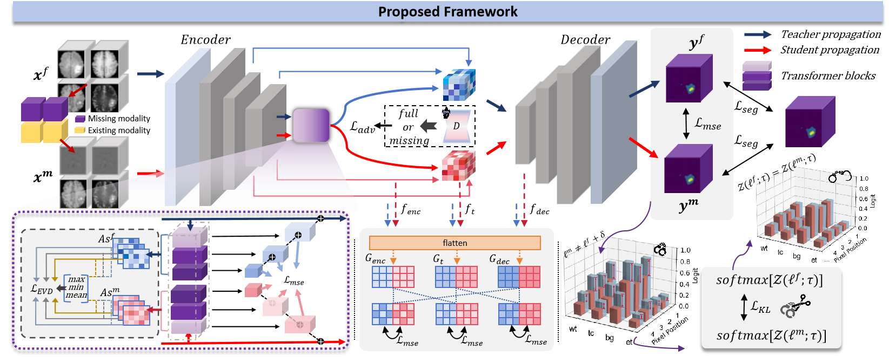
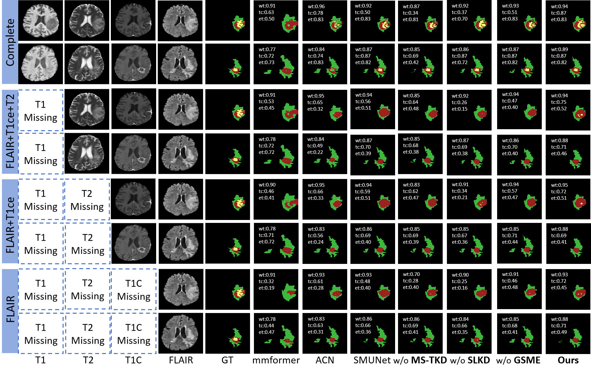
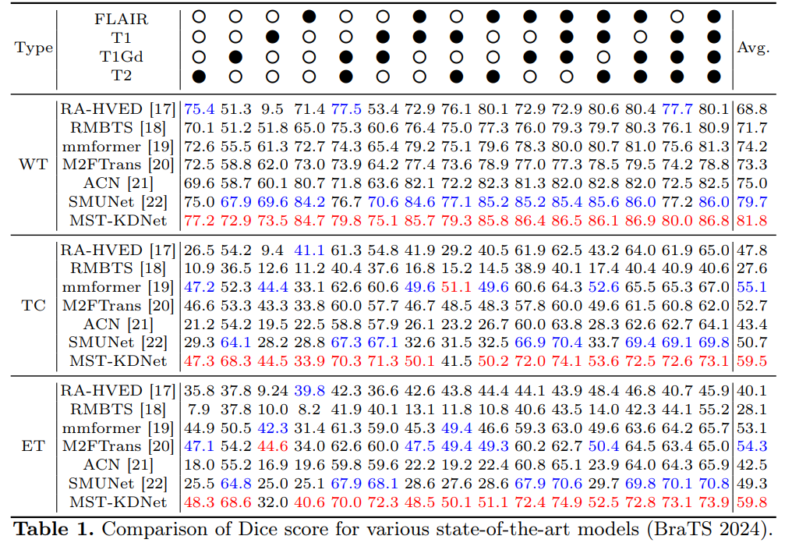
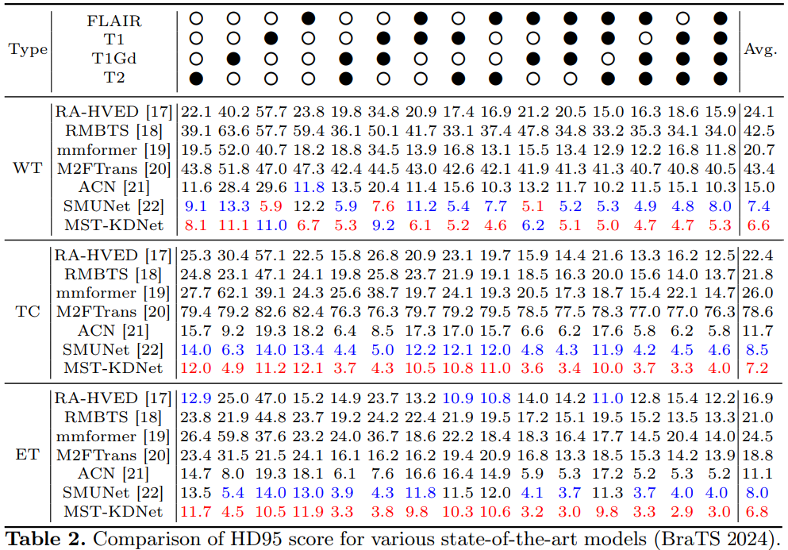
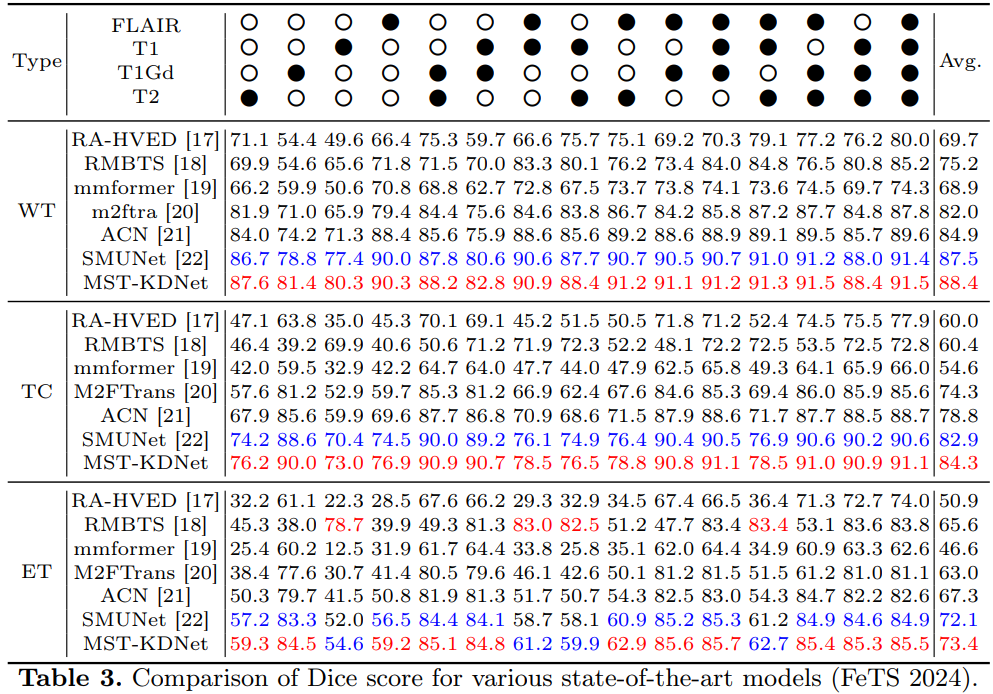
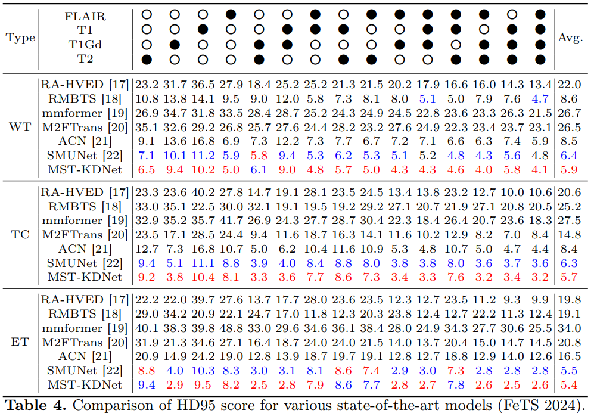
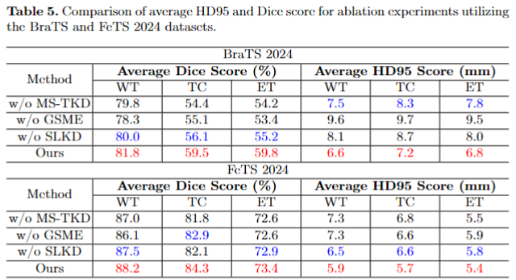

>📋  For code accompanying Muti-scale Transformer Knowledge Distillation Network of the paper

# Bridging the Gap in Missing Modalities: Leveraging Knowledge Distillation and Style Matching for Brain Tumor Segmentation

<div align="center">
  
[](https://github.com/Quanato607/MST-KDNet)
[](https://github.com/Quanato607/MST-KDNet)
[](https://github.com/Quanato607/MST-KDNet)
</div>

This repository is the official implementation of [MST-KDNet](https://arxiv.org/abs/2030.12345). 
<br><br>

<br><br>

## 📝 Requirements

To install requirements:

```setup
pip install -r requirements.txt
```

## 🔥 Training

To train the model(s) in the paper, run this command:

```train
python train.py
```

>📋  Before training, specify the data set and training configuration using the config.xml file

## 📃 Evaluation

To evaluate my model on ImageNet, run:

```eval
python eval.py
```

>📋  segmentation visualizations bellow

<br><br>

<br><br>

## ⭐ Results

Our model achieves the following performance on :

### [Comparison Experiment on Brats2024](https://www.synapse.org/Synapse:syn53708249)
<br><br>

<br><br>
<br><br>

<br><br>

### [Comparison Experiment on Fets2024](https://www.synapse.org/Synapse:syn53708249)
<br><br>

<br><br>
<br><br>

<br><br>

### [Alation Experiment on Fets2024](https://www.synapse.org/Synapse:syn53708249)
<br><br>

<br><br>


## 🤝 Contributing

>📋  Pick a licence and describe how to contribute to your code repository. 
