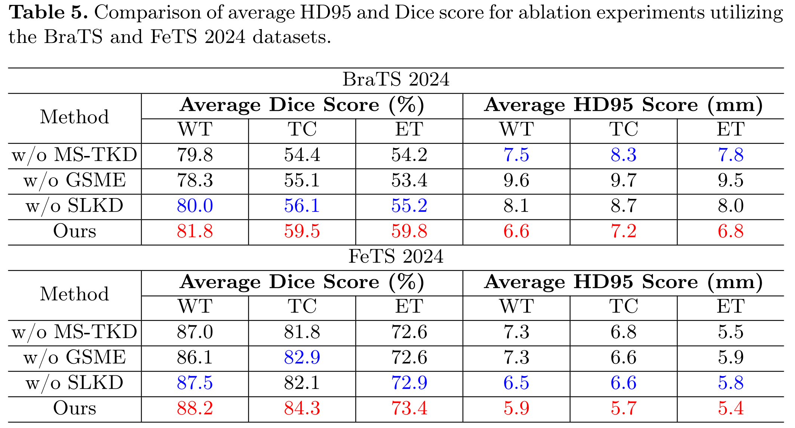

>📋 For code accompanying Muti-scale Transformer Knowledge Distillation Network of the paper

# Bridging the Gap in Missing Modalities: Leveraging Knowledge Distillation and Style Matching for Brain Tumor Segmentation

<div align="center">

[](https://github.com/Quanato607/MST-KDNet)
[](https://github.com/Quanato607/MST-KDNet)
[](https://github.com/Quanato607/MST-KDNet)
[](https://arxiv.org/abs/2030.12345)
</div>

This repository is the official implementation of [MST-KDNet](https://arxiv.org/abs/2030.12345). Our method maintains robust and accurate segmentation performance even under severe modality loss. Furthermore, to reduce redundancy in modality-specific features, **we incorporate global and local feature refinements to systematically align available modalities and mitigate missing ones.**

## 🎥Visualization for Implementation on Software 

<div align="center">

</div>

## 💡Primary contributions

**To overcome the challenges of missing or incomplete MRI modalities in brain tumor segmentation, we propose MST-KDNet. This is a novel framework for cross-modality consistency and robust tumor segmentation in 3D medical images based on knowledge distillation and style matching. Our key contributions are summarized as follows:

🕐 MST-KDNet architecture achieves efficient segmentation under missing modalities by selectively aligning multi-scale Transformer features. This design effectively bridges modality gaps while preserving tumor boundary details.

🕑 MST-KDNet significantly accelerates inference, requiring only a compact distillation procedure instead of heavy fusion modules, making it more adaptable to real-world clinical settings.

🕒 We introduce Global Style Matching Module (GSME) to harmonize heterogeneous modality features and retain texture consistency even with severely missing imaging signals, without extra costly training data.

🕓 Extensive experiments on both the BraTS 2024 and FeTS 2024 datasets demonstrate superior performance and robustness of MST-KDNet, achieving state-of-the-art results especially in scenarios with multiple missing modalities.

## 🧗Proposed method

<br><br>

<br><br>

The overall framework of **MST-KDNet**. The Teacher propagation processes all available modalities, while the student propagation accommodates incomplete inputs.

## Table of Contents
- [Requirements](#-Requirements)
- [Training](#-Training)
- [Evaluation](#-Evaluation)
- [Results](#-Results)
- [Contributing](#-Contributing)

## 📝 Requirements

To install requirements:

```setup
pip install -r requirements.txt
```

## 🔥 Training

To train our model in the paper, run this command:

```train
python train.py
```

>📋 Before training, specify the data set and training configuration using the config.xml file

## 📃 Evaluation

To evaluate our model in the paper, run this command:

```eval
python eval.py
```

<br><br>

<br><br>

>📋 Comparison of segmentation results under four missing-modality scenarios: (1) all modalities, (2) FLAIR + T1ce + T2, (3) FLAIR + T1ce, and (4) FLAIR only. From left to right, the figure shows T1, T2, T1ce, and FLAIR images; ground-truth labels for two patients; three columns of comparison-study results; three columns of ablation-study results; and our final segmentation. Color legend: WT = red + yellow + green, TC = red + yellow, ET = red.
  
## 🚀 Results

Our model achieves the following performance on :

### [Comparison Experiment on BraTS 2024](https://www.synapse.org/Synapse:syn53708249)
<br><br>

<br><br>
<br><br>

<br><br>

### [Comparison Experiment on FeTS 2024](https://www.synapse.org/Synapse:syn53708249)
<br><br>

<br><br>
<br><br>

<br><br>

### Ablation Experiment on BraTS 2024 & FeTS 2024
<br><br>

<br><br>


## 🤝 Contributing

>📋 Pick a licence and describe how to contribute to your code repository. 
