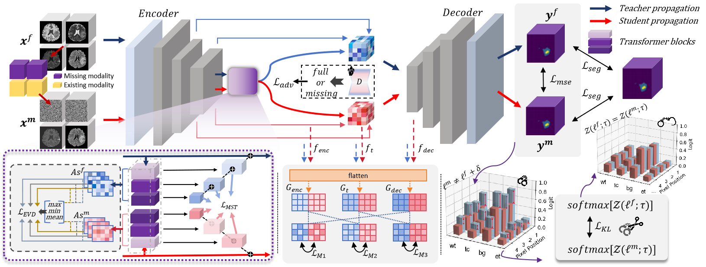

>📋 For code accompanying Muti-scale Transformer Knowledge Distillation Network of the paper

# Bridging the Gap in Missing Modalities: Leveraging Knowledge Distillation and Style Matching for Brain Tumor Segmentation

<div align="center">

[](https://github.com/Quanato607/MST-KDNet)
[](https://github.com/Quanato607/MST-KDNet)
[](https://github.com/Quanato607/MST-KDNet)
[](https://arxiv.org/abs/2030.12345)
</div>

This repository is the official implementation of **[MST-KDNet](https://arxiv.org/abs/2030.12345)**. Our method maintains **robust** and **accurate segmentation performance even under severe modality loss**. Furthermore, to reduce redundancy in modality-specific features, we incorporate **global and local feature refinements** to **systematically align available modalities and mitigate missing ones**.

## 🎥Visualization for Implementation on Software 

<div align="center">

</div>

## 💡Primary contributions

To overcome the challenges of missing or incomplete MRI modalities in brain tumor segmentation, we propose **MST-KDNet**. This is a novel framework for **cross-modality consistency** and **robust tumor segmentation in 3D medical images based on knowledge distillation and style matching**. Our key contributions are summarized as follows:

1) 🕐 MST-KDNet architecture achieves **efficient segmentation** under **missing modalities** by selectively aligning multi-scale Transformer features. This design effectively bridges modality gaps while preserving tumor boundary details.

2) 🕑 MST-KDNet significantly accelerates **inference**, **requiring only a compact distillation procedure instead of heavy fusion modules**, making it more adaptable to real-world clinical settings.

3) 🕒 We introduce **Global Style Matching Module (GSME)** to harmonize **heterogeneous modality features** and **retain texture consistency** even with severely missing imaging signals, without extra costly training data.

4) 🕓 Extensive experiments on both the **BraTS 2024** and **FeTS 2024 datasets** demonstrate **superior performance** and **robustness** of MST-KDNet, achieving state-of-the-art results especially in scenarios with multiple missing modalities.

## 🧗Proposed method
<br><br>

<br><br>

The overall framework of **MST-KDNet**. The Teacher propagation processes all available modalities, while the student propagation accommodates incomplete inputs.

## Table of Contents
- [Requirements](#-Requirements)
- [Training](#-Training)
- [Evaluation](#-Evaluation)
- [Results](#-Results)
- [Contributing](#-Contributing)

## 📝 Requirements

To install requirements:

```setup
pip install -r requirements.txt
```

## 🔥 Training

To train our model in the paper, run this command:

```train
python train.py
```

>📋 Before training, specify the data set and training configuration using the config.xml file

## 📃 Evaluation

To evaluate our model in the paper, run this command:

```eval
python eval.py
```

<br><br>

<br><br>

>📋 Comparison of segmentation results under four missing-modality scenarios: (1) all modalities, (2) FLAIR + T1ce + T2, (3) FLAIR + T1ce, and (4) FLAIR only. From left to right, the figure shows T1, T2, T1ce, and FLAIR images; ground-truth labels for two patients; three columns of comparison-study results; three columns of ablation-study results; and our final segmentation. Color legend: WT = red + yellow + green, TC = red + yellow, ET = red.
  
## 🚀 Results

Our model achieves the following performance on :

### [Comparison Experiment on BraTS 2024](https://www.synapse.org/Synapse:syn53708249)
<br><br>

<br><br>
<br><br>

<br><br>

### [Comparison Experiment on FeTS 2024](https://www.synapse.org/Synapse:syn53708249)

<br><br>

<br><br>
<br><br>

<br><br>

### Ablation Study on BraTS 2024

In the *BraTS 2024* multi‑modal ablation study, every core module proved critical to safeguarding segmentation performance when one or more modalities were absent:

* **Multi‑Scale Transformer Knowledge Distillation (MS‑TKD).**  
  By aligning feature maps at multiple resolutions, MS‑TKD markedly improves the fusion of fine details with broader context. Removing this module reduced the mean **Whole Tumour (WT) Dice** by **2.0 pp** and increased **HD95** by **0.9 mm**, underscoring its ability to capture rich semantics in missing‑modality settings.  

* **Dual‑Modality Logit Distillation (DMLD).**  
  Joint optimisation with MSE and normalised KL losses enforces semantic consistency between teacher and student networks. Without DMLD, **Tumour Core (TC) Dice** fell by **3.4 pp** and **Enhancing Tumour (ET) Dice** by **4.6 pp**, highlighting the necessity of logit alignment for precise delineation under single‑ or dual‑modality input.  

* **Global Style Matching & Enhancement (GSME).**  
  GSME compensates for texture and style discrepancies across modalities. Omitting it cut **ET Dice** by **6.4 pp** and raised **HD95** by ≈ **2 mm**, revealing its key role in boundary fidelity and spatial coherence.

| Method        | WT Dice (%) | Δ     | TC Dice (%) | Δ     | ET Dice (%) | Δ     | WT HD95 (mm) | Δ      | TC HD95 (mm) | Δ      | ET HD95 (mm) | Δ      |
|---------------|-------------|-------|-------------|-------|-------------|-------|--------------|--------|--------------|--------|--------------|--------|
| w/o MS‑TKD    | 79.8        | –2.0  | 54.4        | –5.1  | 54.2        | –5.6  | 7.5          | +0.9   | 8.3          | +1.1   | 7.8          | +1.0   |
| w/o GSME      | 78.3        | –3.5  | 55.1        | –4.4  | 53.4        | –6.4  | 9.6          | +3.0   | 9.7          | +2.5   | 9.5          | +2.7   |
| w/o SLKD      | 80.0        | –1.8  | 56.1        | –3.4  | 55.2        | –4.6  | 8.1          | +1.5   | 8.7          | +1.5   | 8.0          | +1.2   |
| **Ours**      | **81.8**    |  0.0  | **59.5**    |  0.0  | **59.8**    |  0.0  | **6.6**      |  0.0   | **7.2**      |  0.0   | **6.8**      |  0.0   |

### Ablation Study on FeTS 2024

Ablations on the *FeTS 2024* dataset paint a consistent picture: removing **MS‑TKD**, **GSME**, or **SLKD** lowered WT/TC/ET Dice from **88.2 % / 84.3 % / 73.4 %** to  

* **87.0 % / 81.8 % / 72.6 %** (−MS‑TKD)  
* **86.1 % / 82.9 % / 72.6 %** (−GSME)  
* **87.5 % / 82.1 % / 72.9 %** (−SLKD)  

while **HD95** in all three regions fluctuated by **0.4 – 1.0 mm**. Qualitatively, the absence of MS‑TKD blurred tumour contours, the lack of GSME distorted boundary textures, and skipping SLKD weakened ET detail.

Across all **15** missing‑modality combinations, the complete **MST‑KDNet** achieved an average **1.5 – 2.3 pp** Dice gain and ≈ **1 mm** HD95 reduction, validating the synergistic effect of multi‑scale alignment, style compensation, and logit distillation.

| Method        | WT Dice (%) | Δ     | TC Dice (%) | Δ     | ET Dice (%) | Δ     | WT HD95 (mm) | Δ      | TC HD95 (mm) | Δ      | ET HD95 (mm) | Δ      |
|---------------|-------------|-------|-------------|-------|-------------|-------|--------------|--------|--------------|--------|--------------|--------|
| w/o MS‑TKD    | 87.0        | –1.2  | 81.8        | –2.5  | 72.6        | –0.8  | 7.3          | +1.4   | 6.8          | +1.1   | 5.5          | +0.1   |
| w/o GSME      | 86.1        | –2.1  | 82.9        | –1.4  | 72.6        | –0.8  | 7.3          | +1.4   | 6.6          | +0.9   | 5.9          | +0.5   |
| w/o SLKD      | 87.5        | –0.7  | 82.1        | –2.2  | 72.9        | –0.5  | 6.5          | +0.6   | 6.6          | +0.9   | 5.8          | +0.4   |
| **Ours**      | **88.2**    |  0.0  | **84.3**    |  0.0  | **73.4**    |  0.0  | **5.9**      |  0.0   | **5.7**      |  0.0   | **5.4**      |  0.0   |

## 🤝 Contributing

>📋 Pick a licence and describe how to contribute to your code repository. 
